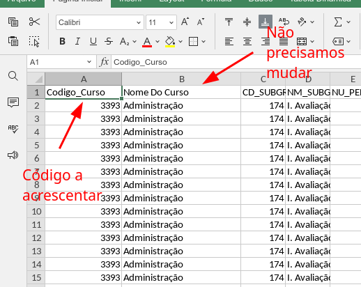
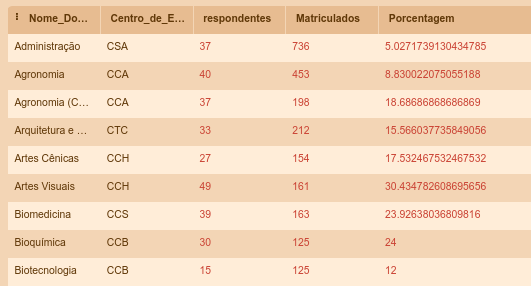
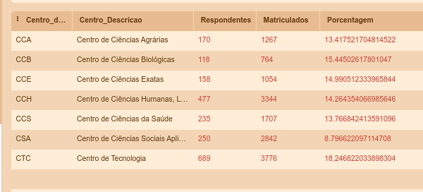
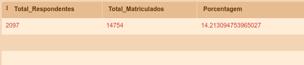

# Comandos para definição de Consultas
----
Faço um exercício com alguns comandos de SQL para facilitar o trabalho com os DataFrames.

Para trabalhar melhor os dados, preferi manter a tabela original de dados vindo do NPD. Somente será necessário acrescentar o código do curso na primeira coluna, conforme indica a imagem abaixo.




Se quiser fazer testes de SQL, podemos usar o site:
https://sqliteonline.com/

Assim não é necessário instalar um servidor de banco de dados ou um app para trabalhar com SQLite. 

Acredito que em breve, vamos ter que trabalhar com outro tipo de código para fazer a combinação entre tabelas. 


## Importante
É interessante que os DataFrames tenham o mesmo nome do arquivo CSV, pois assim facilita a consulta usando os comandos abaixo.


----

# Consulta por cursos

- [Comandos para definição de Consultas](#comandos-para-definição-de-consultas)
  - [Importante](#importante)
- [Consulta por cursos](#consulta-por-cursos)
  - [Obter a lista de Respondentes por Curso](#obter-a-lista-de-respondentes-por-curso)
  - [Obter a lista de centro, cursos e matriculados de 2021](#obter-a-lista-de-centro-cursos-e-matriculados-de-2021)
  - [Concatenar as duas buscas](#concatenar-as-duas-buscas)
  - [Filtro aplicado ao CCE](#filtro-aplicado-ao-cce)
  - [Tabela de Cursos por Centro de Ensino e Ano de Referência](#tabela-de-cursos-por-centro-de-ensino-e-ano-de-referência)
- [Tabelas de Índices Respondentes e Matriculados](#tabelas-de-índices-respondentes-e-matriculados)
  - [Respondentes, Matriculados e Índice por Curso](#respondentes-matriculados-e-índice-por-curso)
  - [Matriculados e Respondentes por Centro em um ano específico](#matriculados-e-respondentes-por-centro-em-um-ano-específico)
  - [Respondentes, Matriculados e Porcentagem de toda a instituição](#respondentes-matriculados-e-porcentagem-de-toda-a-instituição)


## Obter a lista de Respondentes por Curso
Um comando rápido para calcular o total de respondentes. 

```
SELECT 
    nome_do_curso, 
    MAX(total_do_curso) AS Respondentes 
FROM 
    avaliacao_discente_ere_2020 
GROUP BY 
    nome_do_curso;
```

## Obter a lista de centro, cursos e matriculados de 2021

Esse comando permite com que sejam listados todos os alunos matriculados de um determinado ano.

```
SELECT * 
FROM 
    cursos_e_centros 
WHERE 
    ano_referencia=2021 
ORDER BY 
    centro_de_ensino, nome_do_curso;
```

## Concatenar as duas buscas
Nessa parte eu tento combinar as duas buscas para facilitar o trabalho de consulta às tabelas. 

```
SELECT ad.codigo_curso, 
		cc.centro_de_ensino,
        /* Aqui faço uma combinação meio maluca para
        listar os nomes dos cursos e os nomes dos centros de forma declarada. 
        É só um exercício que usei para tentar combinar as tabelas.
        */
        (SELECT cd.centro_descricao from centros_e_diretores cd WHERE cd.centro_de_ensino=cc.centro_de_ensino) as Centro_Descricao,
        cc.nome_do_curso, 

        cc.matriculados,
        ad.cd_subgrupo,
        ad.nm_subgrupo,
        ad.nu_pergunta,
        ad.pergunta,
        ad.ordem_opções,
        ad.opção,
        ad.porcentagem,
        ad.respostas,
        ad.total_do_curso
        
/* Aqui faço a combinação de duas tabelas como se fosse uma única tabela.
    Tabela AD - Avaliação Discente
    Tabela CC - Cursos e Centros
*/

FROM 
    avaliacao_discente_ere_2020 ad JOIN
    cursos_e_centros cc 

/* Listagem dos matriculados de 2021 */
where 
	cc.codigo_curso=ad.codigo_curso AND 
    cc.ano_referencia = 2021;

```

## Filtro aplicado ao CCE

Formatação do filtro por Centro e Por período de 2020.

```
SELECT 
	cc.nome_do_curso,
	ad.cd_subgrupo,
    ad.nm_subgrupo,
    ad.nu_pergunta,
    ad.pergunta,
    ad.ordem_opções,
    ad.opção,
    ad.porcentagem,
    ad.respostas,
    ad.total_do_curso
FROM 
	avaliacao_discente_ere_2020 ad 
    JOIN
    cursos_e_centros cc 
WHERE
	ad.codigo_curso=cc.Codigo_Curso
    AND
    cc.ano_referencia=2020
    AND 
    cc.centro_de_ensino="CCE";
    

```

## Tabela de Cursos por Centro de Ensino e Ano de Referência
Nessa tabela, listamos as seguintes variáveis. 
- Código do curso
- Nome do Curso
- Centro de Ensino
- Nome do Curso (Reescrito)
- Total de respondentes
- Número de matriculados
- Porcentagem entre os respondentes e matriculados


```
SELECT
    cc.nome_do_curso,
    cc.centro_de_ensino,
    ad.total_do_curso as Respondentes,
    cc.matriculados,
    CAST(ad.total_do_curso AS FLOAT) / CAST(cc.matriculados AS FLOAT) * 100 as Porcentagem
FROM
    /* Junta as duas tabelas */
	avaliacao_discente_ere_2020 ad join cursos_e_centros cc
WHERE	
	ad.codigo_curso=cc.codigo_curso 
    AND
    /* Define o período para obter os matriculados */
    cc.ano_referencia=2020
    AND
    /* Informa o centro de Ensino */
    cc.Centro_de_Ensino="CCE"
GROUP BY 
	ad.codigo_curso
ORDER BY
	cc.nome_do_curso


```

# Tabelas de Índices Respondentes e Matriculados

## Respondentes, Matriculados e Índice por Curso

Após definir o ano específico, a tabela retornará as seguintes informações:
- Nome do Curso
- Centro de Ensino
- Total de Respondentes a partir do valor mínimo
- Número de matriculados
- Porcentagem entre os respondentes e os matriculados

````
SELECT 
	cc.nome_do_curso, 
    cc.centro_de_ensino, 
    min(ad.total_do_curso) as total_respondentes, 
    cc.matriculados as total_matriculados,
    CAST(Min(ad.total_do_curso) AS FLOAT) / CAST(cc.matriculados AS FLOAT) * 100 as Porcentagem
FROM 
	avaliacao_discente_ere_2020 ad, 
    cursos_e_centros cc 
WHERE
	ad.codigo_curso = cc.codigo_curso 
  and
  	cc.ano_referencia = "2020"
group by 
	ad.nome_do_curso
````

Tabela resultado.



## Matriculados e Respondentes por Centro em um ano específico

Essa consulta é um pouquinho mais complicada. Ou talvez, eu tenha complicado, não sei. 

Nessa consulta trabalhamos tabelas combinadas em dois níveis. Primeiro, fazemos um filtro por todos os cursos separados por Centro. Em seguida, fazemos um novo filtro direcionado aos centros. De repente pode ter uma forma mais simples de se resolver essa formatação. Se tiver, posso repensar essa consulta. Acredito que pelo tamanho das tabelas, ela não será tão pesada assim. 

Essa consulta aproveita o SELECT feito na seção anterior. Como resultado teremos os seguintes dados:

- Centro de Ensino (sigla)
- Centro de Ensino (descrição)
- Total dos respondentes por Centro
- Total de Matriculados por Centro
- Porcentagem entre os Respondentes e Matriculados

```
SELECT 
	centros.centro_de_ensino,
    cd.centro_descricao,
    sum(centros.Respondentes) Respondentes,
    sum(centros.Matriculados) Matriculados, 
    CAST(sum(centros.Respondentes) AS FLOAT) / CAST(sum(centros.Matriculados) AS FLOAT) * 100 as Porcentagem
FROM	
    (SELECT
        cc.Centro_de_Ensino as Centro_de_Ensino,
        ad.Nome_do_Curso as Nome_do_Curso,
        min(ad.total_do_curso) as Respondentes,
        cc.Matriculados as Matriculados
    FROM 
        avaliacao_discente_ere_2020 ad
        JOIN
        cursos_e_centros cc
    WHERE

        /* Aqui entra a definição do ano para puxar os matriculados */
        cc.ano_referencia = "2020"
        AND	
        ad.codigo_curso = cc.codigo_curso
    GROUP BY 
        ad.nome_do_curso) centros 
        JOIN
        centros_e_diretores cd
WHERE
	centros.centro_de_ensino = cd.centro_de_ensino
GROUP BY 
	centros.centro_de_ensino
ORDER BY
	centros.centro_de_ensino

```

Resultado da consulta:



## Respondentes, Matriculados e Porcentagem de toda a instituição

Essa consulta aproveita o SELECT da seção anterior e somente faz um somatório, retorna os seguintes dados:

- Total dos Respondentes
- Total dos Matriculados
- Porcentagem entre os Respondentes e Matriculados 


````
SELECT 
    sum(geral.Respondentes) Total_Respondentes,
    sum(geral.Matriculados) Total_Matriculados,
    CAST(sum(Respondentes) as float) / CAST(sum(Matriculados)  as float) * 100 as Porcentagem
FROM 
    (SELECT 
        centros.centro_de_ensino,
        cd.centro_descricao,
        sum(centros.Respondentes) Respondentes,
        sum(centros.Matriculados) Matriculados, 
        CAST(Respondentes AS FLOAT) / CAST(Matriculados AS FLOAT) * 100 as Porcentagem
    FROM	
        (SELECT
            cc.Centro_de_Ensino as Centro_de_Ensino,
            ad.Nome_do_Curso as Nome_do_Curso,
            min(ad.total_do_curso) as Respondentes,
            cc.Matriculados as Matriculados
        FROM 
            avaliacao_discente_ere_2020 ad
            JOIN
            cursos_e_centros cc
        WHERE

            /* Aqui entra a definição do ano para puxar os matriculados */
            cc.ano_referencia = "2020"
            AND	
            ad.codigo_curso = cc.codigo_curso
        GROUP BY 
            ad.nome_do_curso) centros 
            JOIN
            centros_e_diretores cd
    WHERE
        centros.centro_de_ensino = cd.centro_de_ensino
    GROUP BY 
        centros.centro_de_ensino
    ORDER BY
        centros.centro_de_ensino) geral

````
Resultado esperado:

