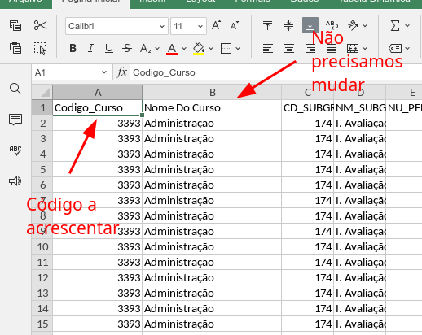
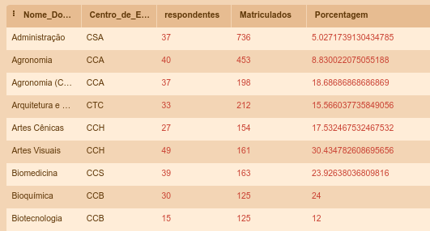
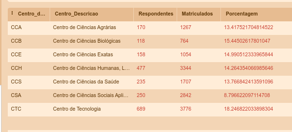

# Comandos para definição de Consultas
----
Faço um exercício com alguns comandos de SQL para facilitar o trabalho com os DataFrames.

Para trabalhar melhor os dados, preferi manter a tabela original de dados vindo do NPD. Somente será necessário acrescentar o código do curso na primeira coluna, conforme indica a imagem abaixo.

Se quiser fazer testes de SQL, podemos usar o site:
https://sqliteonline.com/

Assim não é necessário instalar um servidor de banco de dados ou um app para trabalhar com SQLite. 

Acredito que em breve, vamos ter que trabalhar com outro tipo de código para fazer a combinação entre tabelas. 

# Nova forma de consulta

Outra forma de consulta foi realizada com as novas tabelas passadas pelo NPD. 

Os testes estão descritos na [página sobre os comandos](selecoes.md).

## Importante
É interessante que os DataFrames tenham o mesmo nome do arquivo CSV, pois assim facilita a consulta usando os comandos abaixo.

----

# Consulta por cursos

- [Comandos para definição de Consultas](#comandos-para-definição-de-consultas)
  - [Importante](#importante)
- [Consulta por cursos](#consulta-por-cursos)
  - [Obter a lista de Respondentes por Curso](#obter-a-lista-de-respondentes-por-curso)
  - [Obter a lista de centro, cursos e matriculados de 2021](#obter-a-lista-de-centro-cursos-e-matriculados-de-2021)
  - [Concatenar as duas buscas](#concatenar-as-duas-buscas)
  - [Filtro aplicado ao CCE](#filtro-aplicado-ao-cce)
  - [Tabela de Cursos por Centro de Ensino e Ano de Referência](#tabela-de-cursos-por-centro-de-ensino-e-ano-de-referência)
- [Tabelas de Índices Respondentes e Matriculados](#tabelas-de-índices-respondentes-e-matriculados)
  - [Respondentes, Matriculados e Índice por Curso](#respondentes-matriculados-e-índice-por-curso)
  - [Matriculados e Respondentes por Centro em um ano específico](#matriculados-e-respondentes-por-centro-em-um-ano-específico)
  - [Respondentes, Matriculados e Porcentagem de toda a instituição](#respondentes-matriculados-e-porcentagem-de-toda-a-instituição)

## Obter a lista de Respondentes por Curso
Um comando rápido para calcular o total de respondentes. 

* [SQL: Lista de Respondentes](listaDeRespondentesPorCurso.sql)

## Obter a lista de centro, cursos e matriculados de 2021

Esse comando permite com que sejam listados todos os alunos matriculados de um determinado ano.

* [SQL: Lista de Centros, Cursos e Matriculados](listaCentrosCursosMatriculados.sql)

## Concatenar as duas buscas
Nessa parte eu tento combinar as duas buscas para facilitar o trabalho de consulta às tabelas. 

* [SQL: Concatenar Busca de Respondentes com Centro, Cursos e Matriculados](concatenarBuscasRespondentesComListaDeCentros.sql)

Resultado esperado:

## Aplicar Filtro a Determinado Centro de Ensino

Formatação do filtro por Centro e Por período de 2020.

* [SQL: Filtro a Centro de Ensino](aplicarFiltroCentroEnsino.sql)

Resultado esperado:

## Tabela de Cursos por Centro de Ensino e Ano de Referência
Nessa tabela, listamos as seguintes variáveis. 
- Código do curso
- Nome do Curso
- Centro de Ensino
- Nome do Curso (Reescrito)
- Total de respondentes
- Número de matriculados
- Porcentagem entre os respondentes e matriculados

[SQL: Tabela de Cursos por Centro e Ano de Referência](tabularCursosPorCentroEAno.sql)

Resultado esperado:

# Tabelas de Índices Respondentes e Matriculados

## Respondentes, Matriculados e Índice por Curso

Após definir o ano específico, a tabela retornará as seguintes informações:
- Nome do Curso
- Centro de Ensino
- Total de Respondentes a partir do valor mínimo
- Número de matriculados
- Porcentagem entre os respondentes e os matriculados

[SQL: Listar Respondentes, Matriculados por Curso](listarRespondentesMatriculadosPorCurso.sql)

Tabela resultado.

## Matriculados e Respondentes por Centro em um ano específico

Essa consulta é um pouquinho mais complicada. Ou talvez, eu tenha complicado, não sei. 

Nessa consulta trabalhamos tabelas combinadas em dois níveis. Primeiro, fazemos um filtro por todos os cursos separados por Centro. Em seguida, fazemos um novo filtro direcionado aos centros. De repente pode ter uma forma mais simples de se resolver essa formatação. Se tiver, posso repensar essa consulta. Acredito que pelo tamanho das tabelas, ela não será tão pesada assim. 

Essa consulta aproveita o SELECT feito na seção anterior. Como resultado teremos os seguintes dados:

- Centro de Ensino (sigla)
- Centro de Ensino (descrição)
- Total dos respondentes por Centro
- Total de Matriculados por Centro
- Porcentagem entre os Respondentes e Matriculados

[SQL: Matriculados e Respondentes por Centro](listarMatriculadosERespondentesPorCentro.sql)

Resultado da consulta:

## Respondentes, Matriculados e Porcentagem de toda a instituição

Essa consulta aproveita o SELECT da seção anterior e somente faz um somatório, retorna os seguintes dados:

- Total dos Respondentes
- Total dos Matriculados
- Porcentagem entre os Respondentes e Matriculados 

[SQL: Respondentes, Matriculados e Porcentagem da UEM](listarRespondentesMatriculadosPorcentagemdaUEM.sql)

Resultado esperado:

# Tratamento das tabelas vindas pelo NPD

O NPD tem um processo próprio de exportar as tabelas com os resultados da pesquisa. Para lidar com essa questão e adequar ao software, precisamos aplicar algumas mudanças e filtros. 

No presente exemplo, trabalhamos com duas tabelas: Discente de Graduação e Centros_Cursos.

Essas tabelas podem ser importadas dos CSVs que constam na pasta [csv](<csv/>).

O exemplo abaixo retorna os cursos do Centro de Ensino CCE e traz as informações sobre o ano de referência 2021.

* [SQL: Tratamento da Tabelas para Rotina em Julia](tratamentoTabelasVindasNPD.sql)