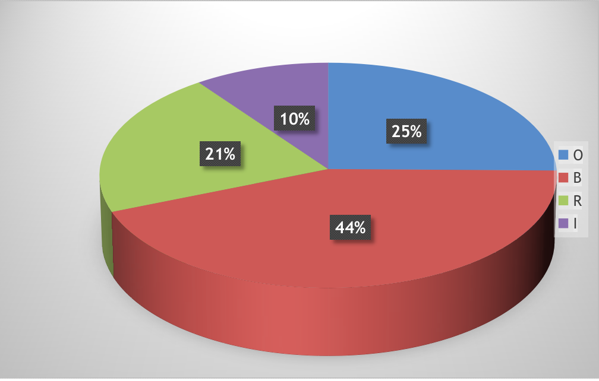

## %Pergunta%

Na Parte I, Sobre Autoavaliação Discente, o aluno atribui um conceito a diferentes aspectos de sua participação/desempenho no curso.

Os resultados do ano de 2020, em percentual de respondentes, sobre a forma como os alunos se autoavaliaram estão discriminados na Tabela 3, seguida do gráfico correspondente.

Tabela 3- Autoavaliação discente, **Curso de %curso%**, 2020

| GRUPO 1 - PARTE I- SOBRE A AUTOAVALIAÇÃO DISCENTE          |   O  |   B  |   R  |   I  | Total |
|------------------------------------------------------------|:----:|:----:|:----:|:----:|-------|
| Sua frequência na disciplina                               | 41,7 | 25,0 | 25,0 |  8,3 | 100,0 |
| Sua pontualidade na disciplina                             | 16,7 | 50,0 | 33,3 |  0,0 | 100,0 |
| Seu empenho e participação na disciplina                   | 16,7 | 66,7 |  8,3 |  8,3 | 100,0 |
| Sua aprendizagem na disciplina                             |  8,3 | 50,0 | 33,3 |  8,3 | 100,0 |
| Seu interesse despertado na disciplina                     | 41,7 | 33,3 | 16,7 |  8,3 | 100,0 |
| Seu entusiasmo despertado na disciplina                    |  9,1 | 45,5 | 27,3 | 18,2 | 100,0 |
| Seu tempo disponível de dedicação aos estudos              |  8,3 | 41,7 | 25,0 | 25,0 | 100,0 |
| Como você usa a disponibilidade do docente                 | 33,3 | 33,3 | 16,7 | 16,7 | 100,0 |
| Sua integração com os demais colegas de sala na disciplina | 50,0 | 33,3 |  8,3 |  8,3 | 100,0 |
| Seu nível de aproveitamento na disciplina como um todo     | 25,0 | 58,3 | 16,7 |  0,0 | 100,0 |
| TOTAL                                                      | 25,2 | 43,7 | 21,0 | 10,1 | 100,0 |

Gráfico 1- Autoavaliação discente, **Curso de %curso%**, 2020

De acordo com o Gráfico 1, em 2020, houve a predominância do conceito 'bom'.