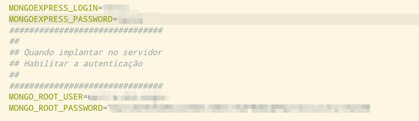

# Servidor de Banco MongoDB

Para habilitar o servidor local ou em produção, é necessário renomear o arquivo env.exemplo para .env.
E nesse arquivo, definir o usuário/senha de acesso e o usuário/senha para gestão do banco de dados.

Editar o arquivo, conforme mostra a image abaixo.


Para ativar o servidor é necessário entrar nesta pasta e ativar o seguinte comando:

```shell
podman-compose pull
podman-compose up -d
```

O servidor MongoDB fica acessível pelo endereço:

localhost:27017


E a página do Mongo Express fica acessível através do endereço:

http://localhost:8080